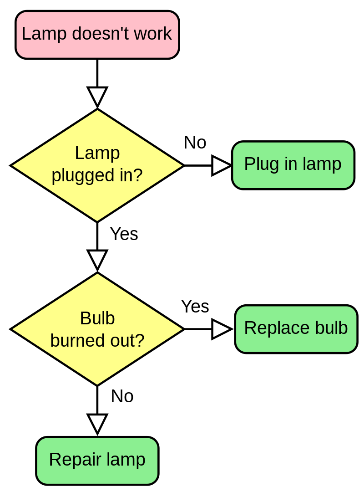
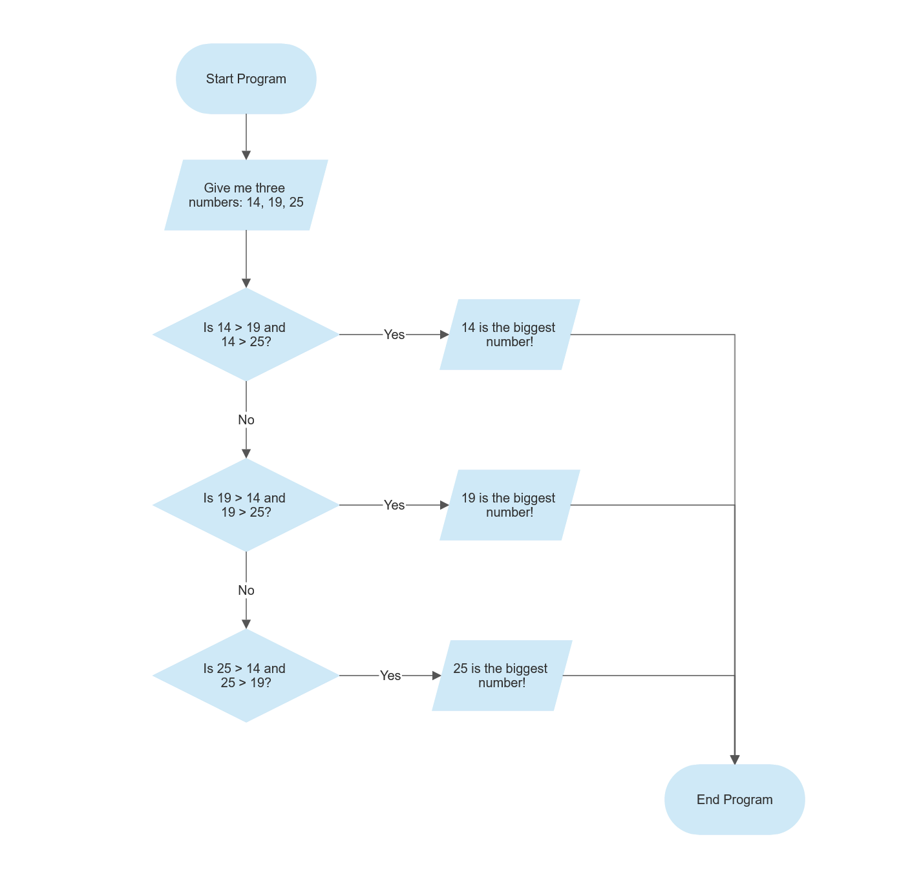

.. _s1-pf-t03:

3) Pseudocode and Flowcharts
----------------------------

| The best way to practice Programming and Flowcharts, are through `Scratch <https://scratch.mit.edu/>`_. It is VERY well designed and very effective at teaching the fundamentals of Programming. I haven't used it much myself but seen great things happen from it, so if you do get the time, PLEASE watch a video on it and give it a try.
|
| I did say in the start that it's more Logic based than it is Maths based, but the thing is those two things kind of go hand in hand. And in the start there's still gonna be a little bit of Maths involved, but I wasn't lying about the level of Maths involved. You don't have to do things like Differential Equations or something. You just have to use the same concepts you've been learning throughout your whole life in a different approach, like thinking with Base 2 instead of Base 10.
|
| Alright so, if you've ever seen a programming language or a program before then it either *does* make sense to you, or it *doesn't*. But the thing is, with so many languages and things to write and ways to perform the same task, there's no universal way to solve a problem.
|
| But during discussions or problem solving, as I said before, the LOGIC must be focused on, and not the actual words used. The best programming happens away from the keyboard. This is why Pseudocode and Flowcharts were invented, to actually do this theoretical stuff.

Pseudocode
^^^^^^^^^^

| Let's say you wanna give me instructions for making some tea. Here's how it would look:
*    1) Fetch a Tea Cup
*    2) Boil some water
*    3) Place a tea bag into the cup
*    4) Let water finish boiling
*    5) Pour boiling water into cup
*    6) Stir Tea Bag
*    7) Remove Tea Bag

| And there you have it, tea has been made. And if you remember the example of Rock Paper Scissors and of the Highest Number which were talked about in :ref:`s1-pf-req1`, then now's a good time to bring up that those examples are also Pseudocode.
| Although the Cambridge International A Levels system did shove Pseudocode down my throat and force me into thinking it has a fixed syntax, the thing is, it doesn't. It's written however you want to write it.
| Pseudocode is just a carefree way to write Code such that there's no specific code involved. It exists purely to figure out the theoretical stuff and the concepts.

Flowcharts
^^^^^^^^^^

| Flowcharts are just visualizations of Pseudocode using Shapes. You might think they're very simple, but believe me they can get very big very fast. It's important to keep organized.
| Flowcharts are a good way to show Condition Checks. You won't study them until way later in :ref:`s1-pf-t12`, but it's good to know about how they work.
|
| Here's a flowchart about trying to fix a Lamp.

|
| Here's a flowchart of the Highest Number problem:

|
| And you're expecting me to also show the answer for the Rock Paper Scissors one, but I did say I'd be leaving exercises at the end of every page for practice. So, you do that one instead. If flowcharts confuse you I highly recommend looking up videos or articles about them, they're very simple and very useful. I'd explain them myself in more detail but this page is already getting very long.
|

Practice Exercises
^^^^^^^^^^^^^^^^^^

| So! Here's the practice exercises (just make them on a pen and paper):
|
*    1) Make Pseudocode and a Flowchart for playing Rock Paper Scissors
*    2) Make Pseudocode and a Flowchart for calculating the average of 2 Numbers
*    3) Make Pseudocode and a Flowchart for checking if a year is a Leap Year
|
| Don't worry about the shapes of the boxes for now. You can make them all rectangles or circles, doesn't matter. Right now the priority is just to check if you can figure out the logic behind a flowchart with what's written inside of them, and where the arrows go. The specifics of Flowcharts will be told on the next page, in :ref:`s1-pf-t04`. That's also where you learn one of the most important things about how all programs would work.
|
| Answers are on :ref:`answers`.
