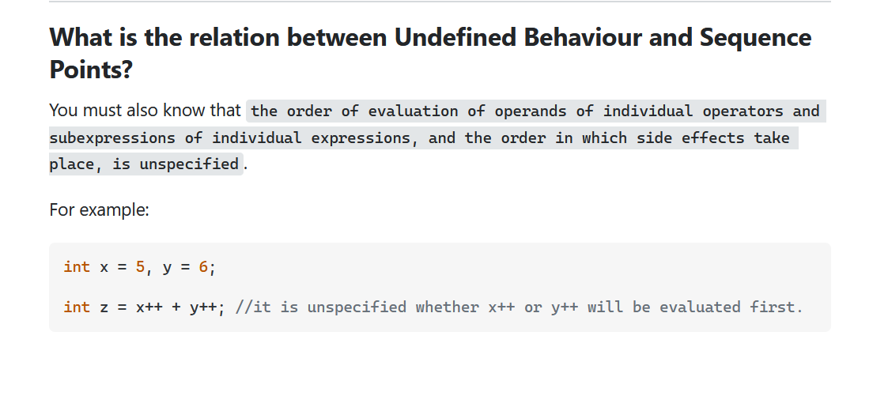

.. _s1-pf-t18:

18) Increment and Decrement
---------------------------

| The concept is easy but it can still test you when there's specifics involved, like all other concepts.

.. code-block:: c++
   :linenos:

	int x = 5;
	x++;
	cout << x << endl; // Output is 6
	++x;
	cout << x << endl; // Output is 7

| That's increment. It's the equivalent of writing ``x = x + 1``.
| Decrement is the same but the other way around.

.. code-block:: c++
   :linenos:

	int x = 5;
	x--;
	cout << x << endl; // Output is 4
	--x;
	cout << x << endl; // Output is 3

| So it's the equivalent of writing ``x = x - 1``.
| What makes it special though is that it actually does assigning, instead of just temporarily calculating.

.. code-block:: c++
   :linenos:

	int x = 5;
	cout << x+1 << endl;

| The output of the code above is ``6``, and if you later call the value of ``x``, it'll be 5. But for this scenario:

.. code-block:: c++
   :linenos:

	int x = 5;
	cout << ++x << endl;

| The output of the code above is ``6`` again, but if you later call the value of ``x``, it'll be 6.
|
| The difference between ``++x`` and ``x++`` is when the assignment actually takes place. In the case of ``++x``, it's the equivalent of writing ``x += 1;`` just before using it in the line. In the case of ``x++``, it's the equivalent of writing ``x += 1`` after using it in the line. Give it a try.

.. code-block:: c++
   :linenos:

	int x = 10;
	cout << "Value of x: " << ++x << endl;
	cout << "Value of x: " << x << endl;
	cout << "Value of x: " << x++ << endl;
	cout << "Value of x: " << x << endl;

| You get the output 11, 11, 11, 12 respectively.
|
| There is one thing to be cautious about, which is using multiple increment or decrement statements within the same line.

.. code-block:: c++
   :linenos:

	int x = 10;
	int y = 15;
	int z;
	z = x++ + y++;
	cout << z << endl;

| If you get a question like that, you're being too curious. Which is good, but code should be readable. That is *not* readable. You're better off just incrementing them earlier or later manually using ``x += 1`` or ``y += 1`` or even ``x++`` or ``y++`` in different lines. This is a more readable form:

.. code-block:: c++
   :linenos:

	int x = 10;
	int y = 15;
	int z;
	z = x + y;
	x++;
	y++;
	cout << z << endl;
|
| In fact, not only is it more readable, but it's also predictable. A similar question was also asked on `This StackOverflow Forum <https://stackoverflow.com/questions/6915963/multiple-increment-operators-in-single-statement>`_. I spent a LONG time trying to figure it out, and it didn't make sense to me.

| It's not supposed to. It's not specified if ``x++`` will be evaluated first or ``y++`` will be evaluated first. It depends on the compiler. Different ones can give the same result or a different result or do absolutely anything they want. So, yeah, if something doesn't make sense, try to find out if there's a pattern, and if there isn't, then you just leave it be for a moment and focus on other things then come back with greater knowledge.
