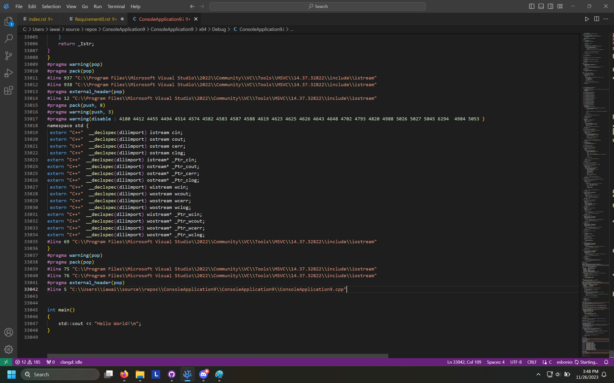

===========================================
Computer Organization and Assembly Language
===========================================

| This site is undergoing updates until the Semester finishes. Please refresh the page to make sure it's the latest version.
|
| Lord have mercy on anyone studying assembly language because it's so much more work and effort compared to any other language. It makes C++ feel like Python in comparison. Actually, no, even worse. It makes C++ feel like *Pseudocode* in comparison.
|
| So you may be wondering why it's worth studying. Well, there's a few reasons. First, robotics, which also includes the Arduino (if you're working with a Raspberry Pi then it's not required because that thing can run Python and has an OS). If you want absolute maximum performance in anything that has anything to do with machines, you'll want to do it in Assembly.
|
| Second, which was a reason I really wish I knew earlier: Despite how fast C++ is, it's still bloated.

| The image above was obtained by first making a Console App in Visual Studio, going to the Project Properties, then to C/C++, and setting ``Preprocess to a file`` to ``Yes (/P)``. After that, you right click the ``.cpp`` file on the right, and click ``Compile``. This creates a ``.i`` file in your Debug folder (where the Console app and ``.cpp`` file is), which turns the ``#include`` line into actual code. Don't do that normally, this was just for showing the image above, and I wrote the process here for anyone wanting to do so themselves, or for future me to do it again.
|
| This ``.i`` file was **SIXTY EIGHT THOUSAND LINES** of code. Most of it was blank lines, though. Removing those gets you the image above, which is still **THIRTY THREE THOUSAND LINES** of code, just to write ``Hello World!``. You can even see the ``int main()`` portion just at the end of the image shown above, where ``Hello World!`` is outputted.
|
| I've never actually embedded Assembly code into C/C++ but I know for a fact it's possible in C because of how low level it is. Might also be doable in C++ but never tried it. Honestly speaking the way COAL is treated in our teaching program is like it's just there for a diversity requirement. There's even the funny story of how you can learn how to do everything via Assembly but then you realize that Compilers are faster because they have extra layers of optimization present in them from decades of research, funding, and development. But hey, it's part of the degree so, gotta document it. Might even be useful in the future. It's fascinating but frustrating, that's the best line I can use to describe it.
|
| Computer Organization and Assembly Language is worth 4 Total Credit Hours. 3 for Theory, and 1 for Lab. That means for 16 weeks, there will be 3 hours a week for Theory and 1 hour a week for Lab. Yes, we do three hours for Lab but that's beside the point. Credit Hours are counted weirdly.
|
| Absolutes if you don't know just means "Out of 100%, it is this many percentage points". So 40 Absolutes means it's worth 40% of the total semester grade.
|
| Outline for COAL Theory:

*    4 Assignments. Total Absolutes: 10 (Marks are based on Quiz Performance)
*    10 or more Quizzes. Total Absolutes: 15
*    1 Sessional-1. Total Absolutes: 12.5
*    1 Sessional-2. Total Absolutes: 12.5
*    1 Project. Total Absolutes: 10
*    1 Final Exam. Total Absolutes: 40

| Outline for COAL Lab:

*    13 or more Lab Tasks. Total Absolutes: 20
*    4 Assignments (Shared with Theory). Total Absolutes: 10
*    4 Quizzes. Total Absolutes: 10
*    1 Project (Shared with Theory). Total Absolutes: 20
*    1 Final Exam. Total Absolutes: 40

Grading Policy is Absolute Grading.

| Textbooks:

*    Computer Organization and Architecture by William Stallings, 9th Edition
*    Assembly Language for x86 Processors by Kip. R. Irvine, 7th Edition

.. toctree::
   :caption: Lectures
   :maxdepth: 1
   :glob:
   
   Requirement0
   Topic01
   Topic02
   Topic03
   
   *
