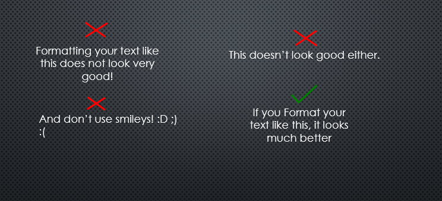
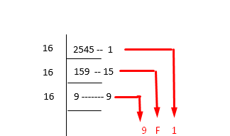
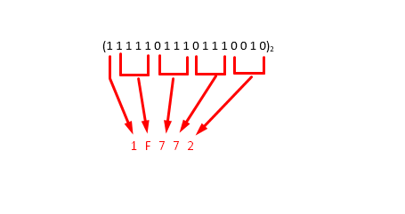

.. _s1-ict-intro:

Semester 1: IICT (Introduction to ICT)
======================================

| IICT has 1 credit hour. 

| Outline for IICT:

*    10 Lab Tasks. Total Absolutes: 15
*    1 Assignment. Total Absolutes: 10
*    1 Presentation. Total Absolutes: 15
*    1 Project. Total Absolutes: 20
*    1 Final Exam. Total Absolutes: 40

| Grading Policy is Absolute Grading.

.. _s1-ict-l01:

Lecture 01:
-----------
Definitions and History:
^^^^^^^^^^^^^^^^^^^^^^^^
| The definitions of Computer, User, Data, Software and IT are discussed. Further, the Evolution of Computers from the first Analog Computers to the Electronic Computers of today is explored. This isn't rocket science.

Lab Work:
^^^^^^^^^
| The lab work consists of using 'Datum', a university-computer only program to log in to and access your files. After that, take a typing test from a pre-installed app and submit your scores. If you actually want to improve your speed though, search for the 'typeracer' or 'aoeu' tests on google (the latter doesn't have any grammar) and practice them, they're better.

.. _s1-ict-l02:

Lecture 02:
-----------
Data Organization:
^^^^^^^^^^^^^^^^^^
| The important things to practice here are:
* 	 Don't keep duplicate files
* 	 Group your files in folders & sub-folders
*	 Give your files descriptive names and use underscores: "Example_file.txt"
*    Keep your desktop clean, avoid cluttering it.

Using MS Word:
^^^^^^^^^^^^^^
| The basic uses of MS Word are explored:
.. figure:: images/mswordone.png
   :scale: 50 %
   :alt: image showing ribbon and quick access toolbar

   The toolbar at the top of the window containing all the editing options you'll want like text size, color, font style, etc. is called the 'Ribbon'. The series of icons at the top left is called the 'Quick Access Toolbar', from where you can save, undo and redo your actions in the document. The tabs above the Ribbon like 'Home', 'Insert' and 'View' all have their separate ribbons, with different sets of commands for your needs.

| In this lab, we created our own newsletter. For this, we inserted images, text boxes, and columns:

.. figure:: images/mswordtwo.png
    :scale: 50 %
    :alt: figure showing how to insert images

    You can insert images by going to the 'Insert' tab and clicking on 'Insert Picture'. Images can be inserted from either your own files or from the web.

| After you've got the image you want, you can insert text under it by double-clicking where you want to start typing.

.. figure:: images/mswordthree.png
    :scale: 50%
    :alt: showing 'in front of text' option for image

    You can change the image's Layout options as well, which allows you to move the image in between page margins and over text, allowing more freedom. This also works for Text Boxes.
 
| Text boxes can similarly be created from the 'Insert' Tab, enabling you to change the font/size/color of separate sections of text.

.. _s1-ict-l03:

Lecture 03:
-----------
Presentation Skills:
^^^^^^^^^^^^^^^^^^^^

| A good presentation is similar to a good paragraph: it contains an introduction, body and a conclusion.

| Introduction:
*    Briefly explain your topic to the audience.
*    Explain why your topic is relevant to the audience. Tailor it to them.
*    Keep it short and concise, with no more than one or two slides dedicated to it.

| Body:
*    This is where the bulk of the information comes in. Elaborate on the main points of your topic here.
*    Include all the facts, quotes and evidence related to your topic.

| Conclusion:
*    Summarize the presentation.
*    Connect it to daily life. How can the audience use what they've learnt? 
*    Keep it to one slide.

| In general, your presentation should be no more than 10 slides in FAST, considering you'll only have 10 minutes for the entire thing. A few things to remember:
*    Use images to properly communicate ideas.
*    Keep concise text in your slides, don't get long-winded. Format your text properly.
*    Don't just stand still! Body language makes up around 55% of human communication, so utilize it.
*    Be enthusiastic. A confident demeanor can make up for a lack of work.
*    Don't make your presentation overly colorful. Stick to one theme. Similarly, stick to one font as well.

| Properly formatted text should look like this. Use this format for quotes, facts, short statements, etc.

| A concise slide should look like this

.. figure:: images/carlsen4.png
    :scale: 85 %

| Remember, the bullets on the slides are for you, not the audience (most of the time). Use them to guide your own thought process and talk about the topic, without overloading the audience with too much information.

Lab Work:
^^^^^^^^^
| The lab work here just has you making a presentation with the above format. Experiment with the tabs if you don't know where something is, it's fairly straightforward.

.. _s1-iict-l04:

Lecture 04:
-----------
Number Systems
^^^^^^^^^^^^^^
| Buckle up, this is the biggest topic for this subject.
| You might have heard of the 'base' of of a number in math. For example, 'log base 10'. What this 'base' indicates is the amount of unique symbols the system uses to represent numbers. For example, the number system we use in our day-to-day life is 'base 10', also called the decimal system (the dec- prefix means 10). This means that the decimal number system has 10 unique symbols it uses to represent all numbers, which are '0', '1', '2' and so on until '9'. After reaching the final unique symbol '9', all other numbers are represented with combinations of the first 10 unique symbols. The number '12' in base 10 can be represented as 12 :sub:`10`
| 'Base 10' isn't the only way to represent numbers, however. There are 4 number systems that we're concerned with: Binary, Decimal, Octal and Hexadecimal. Decimal is used by humans, whereas the other 3 systems are widely used by computers.
| As you might've guessed from the names, the base of the binary number system is 2 (the bi- prefix means 2), the base of the octal number system is 8, and the base of the hexadecimal number system is 16. Meaning that each of them have '2', '8' and '16' unique symbols to represent numbers, respectively.
| Let's take binary as an example, since it's what computers are built on. It only has two symbols to represent numbers, '0' and '1'. '0' in binary is also '0' in decimal, though, and '1' in binary is '1' in decimal, since they exist in both bases.
| When we start counting up, though, is when we encounter issues. '1 + 1' in decimal is '2', but '1 + 1' in binary is '10', since there's only two symbols to represent numbers. If we wanted to count numbers in binary with respect to decimal, we could instead keep counting in decimal until we encounter a combination of '0's or '1's. For example, '0' exists in both number systems and is the first value, so '0' is the same in both. Similarly, '1' exists in both, and it's the same. '2' does not exist in binary though, so to imagine that we go to the nearest combination of '1's and '0's after '1' in decimal: which is the number '10'.
| Following this, '3' in binary is just the next combination of '1's or '0's after '10', which is '11'. These numbers can be represented as 3 :sub:`10` = 11 :sub:`2`

.. figure:: images/numbersystems.png
    :scale: 80%
    :alt: a table of the 4 number systems

    Table of the 4 number systems up to 17 numbers. Look at how the numbers increase when they run out of unique symbols.

Converting bases
^^^^^^^^^^^^^^^^
| Decimal Conversion:
| This is the simplest of all conversions, just successively divide the decimal number by the base of the required number:
*     Decimal to Binary: Successively divide the decimal number by 2, and read the remainders from the bottom to the top.
 .. figure:: images/decimaltobinary.png
    :scale: 90 %
            
    17 :sub:`10`  is equal to 10001 :sub:`2`

*     Decimal to Octal: Successively divide the decimal number by 8, and read the remainders from the bottom to the top.
.. figure:: images/octal.png

    148 :sub:`10` is equal to 224 :sub:`8`

*     Decimal to Hexadecimal: Successively divide the decimal number by 16, and read the remainders from the bottom to the top. If the remainder is greater than 10, give it the hexadecimal value associated with that number.

        
    2545 :sub:`10` is equal to 9F1 :sub:`16`

| Binary Conversion:
*     Binary to Decimal: Suppose that we have the digit 111 :sub:`2`. This is 7 :sub:`10` represented in binary. This binary number in decimal form will be the total sum of the numbers multiplied by 2 to the power of their position. 
.. figure:: images/binarydecimal.png
    :scale: 80 %

    111 :sub:`2` = 7 :sub:`10`

*     Binary to Octal: For any Binary value, group the binary digits into groups of 3 - and convert those 3 digits to their octal form. We only need to know how the first 7 binary numbers correspond to their octal counterparts:
.. figure:: images/binarytooctal.png
    :scale: 80%

    110101100101 :sub:`2` = 6545 :sub:`8`

*     Binary to Hexadecimal: Similar to what we did with conversion to Octal, this time group the digits in groups of 4 - and convert *those* digits to their hexadecimal equivalent.

    11111011101110010 :sub:`2` = 1F772 :sub:`16`

        

.. _s1-ict-l05:

Lecture 05:
-----------

.. _s1-ict-l06:

Lecture 06:
-----------
