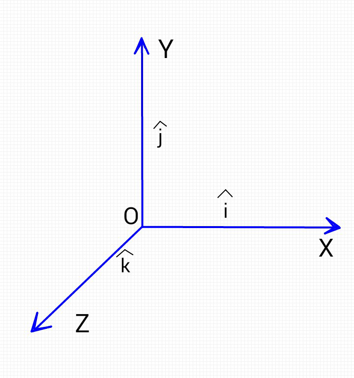
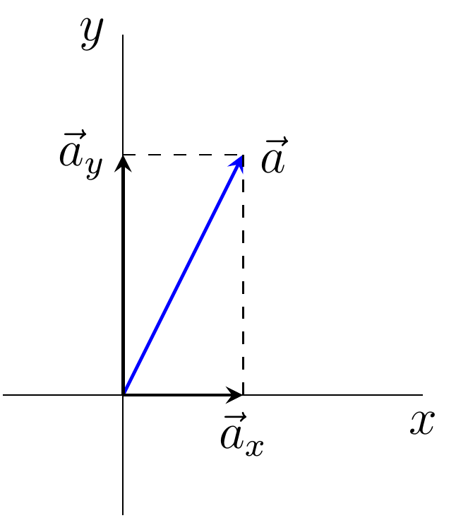

.. _s1-ap-l01:

Week 01
-------

Vectors
^^^^^^^

| Scalars possess only magnitude. Vectors are directional quantities possessing a magnitude and an angle (direction), they are 'arrows' in space. They can be represented in the Cartesian coordinate system using either three (3D) or two (2D) perpendicular axes. The components of the vector are its projections on a rectangular axis.

    This is a right handed coordinate system. A vector rotated 90° from OZ to OY will travel in the positive y-direction.

| Then a vector :math:`\vec{P}` in the 3D Cartesian plane has magnitude :math:`\vert\ \vec{P} \vert` and the components ( :math:`P` :sub:`x`, :math:`P` :sub:`y`, :math:`P` :sub:`z`)

Vector Components
^^^^^^^^^^^^^^^^^

| Consider the vector :math:`\vec{a}` in a 2D Cartesian plane making an angle :math:`\theta` with the x-axis:

| Projection of components: :math:`\vec{a} = ( \vec{a}_{\text{x}}, \vec{a}_{\text{y}} )`. It's evident that :math:`\vec{a}` is the sum of its components.
| The x-component: :math:`a` :sub:`x` = :math:`\vert \vec{a} \vert\cos(\theta)`
| The y-component: :math:`a` :sub:`y` = :math:`\vert \vec{a} \vert\sin(\theta)`
| Magnitude: :math:`\vert \vec{a} \vert = \sqrt{ a_{\text{x}}^2 + a_{\text{y}}^2}`
| Direction: :math:`\tan(\theta) = \frac{a_{\text{y}}}{a_{\text{x}}}`

| Two vectors are equal if they have the same magnitude and direction. :math:`\vec{a} = \vec{b}` gives :math:`a_{\text{x}} = b_{\text{x}}, a_{\text{y}} = b_{\text{y}}`. The same property applies for vectors in 3 dimensions.

Unit Vector
^^^^^^^^^^^

| A unit vector is a vector with magnitude equal to one. On the first figure on this page, three unit vectors :math:`\hat{i}, \hat{j}, \hat{k}` are shown.  These are defined by the perpendicular components of the 3D Cartesian plane:
*    :math:`\hat{i} = (1, 0, 0)`, hence :math:`\vert\hat{i}\vert = 1`
*    :math:`\hat{j} = (0, 1, 0)`, :math:`\vert\hat{j}\vert = 1`
*    :math:`\hat{k} = (0, 0, 1)`, :math:`\vert\hat{k}\vert = 1`

| A unit vector in the direction of the general vector :math:`\vec{a}` is given as :math:`\hat{a} = \frac{\vec{a}}{\vert\vec{a}\vert}`
| Unit vectors are generally used to denote direction alongside a scalar coefficient denoting magnitude. The vector :math:`\vec{a}` can therefore be written as :math:`\vec{a} = a_{\text{x}}\hat{i} + a_{\text{y}}\hat{j} + a_{\text{z}}\hat{k}`

Sum of Vectors
^^^^^^^^^^^^^^

| Calculating the sum of two vectors :math:`\vec{c} = \vec{a} + \vec{b}`
| This can be done graphically via head-to-tail rule; join the tail of the first vector with the head of the last vector.

.. image:: images/headtotail.png

| However, the head to tail rule can get complicated, which is why we instead use components. :math:`\vec{c} = \vec{a} + \vec{b}` in 3D components:

.. math:: 
    (c_{\text{x}}. c_{\text{y}}, c_{\text{z}}) = (a_{\text{x}} + b_{\text{x}}, a_{\text{y}} + b_{\text{y}}, a_{\text{z}} + b_{\text{z}})

.. math::
    :name: Alternatively,
    c_{\text{x}}\hat{i} + c_{\text{y}}\hat{j} + c_{\text{z}}\hat{k}} = (a_{\text{x}} + b_{\text{x}})\hat{i} + (a_{\text{y}} + b_{\text{y}})\hat{j} + (a_{\text{z}} + b_{\text{z}})\hat{k}

Multiplication of Vectors
^^^^^^^^^^^^^^^^^^^^^^^^^

| Multiplication of Vector and Scalar (e.g :math:`\vec{N} = m\centerdot\vec{g}`): 
*    Multiplying a vector with a positive number other than one changes magnitude, but does not change direction.
*    Multiplying a vector with negative one reverses direction but doesn't change magnitude.
*    Multiplying a vector with a negative number other than negative one reverses direction and changes magnitude.

| Multiplication of a Vector with a Vector:
|
| This is further split into two parts, the dot product and the cross product

| Dot Product:
*     Binary operation on two vectors
*     Always results in a scalar value (i.e :math:`W = \vec{F}\centerdot\vec{d}`)
*     Denoted by :math:`\vec{a}\centerdot\vec{b}`
*     :math:`\vec{a}\centerdot\vec{b} = \vert a \vert b \vert\cos(\theta)`
*     The dot product is commutative, i.e :math:`\vec{a}\centerdot\vec{b} = \vec{b}\centerdot\vec{a}`
| The dot product gives the **relative orientation** of two vectors in 2D space. Intuitively, the dot product tells us how much two vectors point in the same direction. This helps us in measuring the angle between the pair of vectors.
| Look at how the dot product uses :math:`\cos(\theta)`, it is evident that dot product of same unit vectors is :math:`\hat{i}\centerdot\hat{i} = \hat{j}\centerdot\hat{j} = \hat{k}\centerdot\hat{k} = 1` and the dot product of perpendicular unit vectors (:math:`\hat{i}\centerdot\hat{j} = 0`, etc.) will be :math:`0`.
Cross Product
^^^^^^^^^^^^^

| The cross product gives the orientation of the **plane** described by two vectors in 3D space. Also called the vector product, it is a binary operation on two vectors that results in a vector value. Represented by :math:`\vec{a}\times\vec{b}`, the cross product is a vector that is perpendicular to both :math:`\vec{a}` and :math:`\vec{b}` and is normal to the plane containing them.
| The cross product is anti-commutative, i.e :math:`\vec{a}\times\vec{b} = - \vec{b}\times\vec{a}` and is given by

.. math::

        \vec{a} \times \vec{b} = \vert a \vert b \vert\sin(\theta)\hat{n}

| Where :math:`\theta` is the angle between the two vectors and :math:`\hat{n}` is the unit vector perpendicular to the plane containing the two vectors. It's direction is given by the right-hand rule.
| Similarly, the cross product of two unit vectors will be perpendicular to the vectors, i.e :math:`\hat{i}\times\hat{j} = \hat{k}`, :math:`\hat{j}\times\hat{k} = \hat{i}`, etc. and the cross product of the same unit vector will be 0: :math:`\hat{i}\times\hat{i} = 0`.

| The cross product is :math:`\vec{a} \times \vec{b} = (a_{\text{x}}\hat{i} + a_{\text{y}}\hat{j} + a_{\text{z}}\hat{k}) \times (b_{\text{x}}\hat{i} + b_{\text{y}}\hat{j} + b_{\text{z}}\hat{k})`
| This can be represented by the determinant of the square matrix

.. math::
    \vec{a} \times \vec{b} = \renewcommand{\arraystretch}{2.5} \left| \begin{array}{ccc}	i & j & k          \\	a_{\text{x}} & a_{\text{y}}    & a_{\text{z}} \\ 	b_{\text{x}} & b_{\text{y}} & b_{\text{z}}	\end{array}\right|

 

