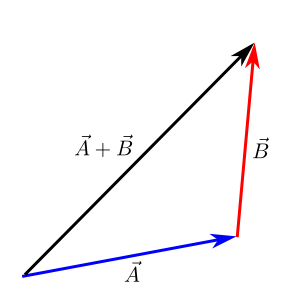
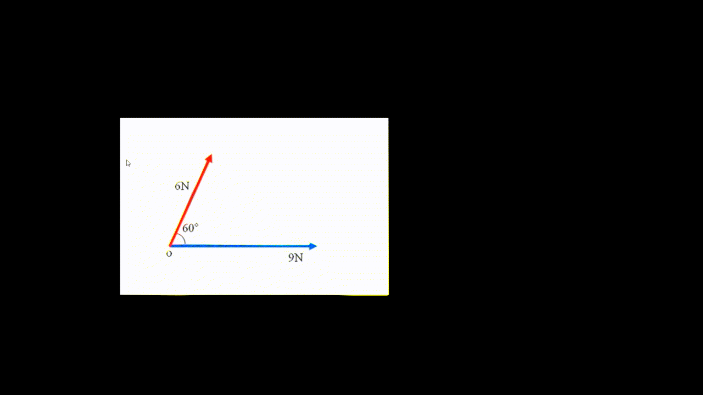

.. _s1-ap-l01:

Vectors
^^^^^^^

| A vector is a quantity possessing both magnitude and direction.
| As vectors are directional quantities, they're represented on the x-y plane with a magnitude and an angle.

| Head-to-Tail Rule:
|
| Graphically, vectors can be added by drawing a line from the tail of the first vector to the head of the last vector. In graphical form, the \(  \bar{C} = \bar{A} + \bar{B} \) can be represented as

| In the case that one or more vectors start at the origin, the vectors can easily be shifted on the plane so that their tails and heads match up:

