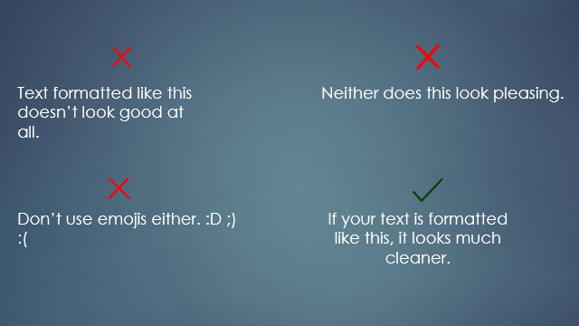
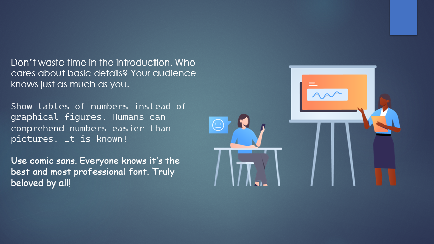

.. _s1-ict-l03:

Lecture 03
----------
Presentation Skills:
^^^^^^^^^^^^^^^^^^^^

| A good presentation is similar to a good paragraph: it contains an introduction, body and a conclusion.

| Introduction:
*    Briefly explain your topic to the audience.
*    Explain why your topic is relevant to the audience. Tailor it to them.
*    Keep it short and concise, with no more than one or two slides dedicated to it.

| Body:
*    This is where the bulk of the information comes in. Elaborate on the main points of your topic here.
*    Include all the facts, quotes and evidence related to your topic.

| Conclusion:
*    Summarize the presentation.
*    Connect it to daily life. How can the audience use what they've learnt? 
*    Keep it to one slide.

| In general, your presentation should be no more than 10 slides in FAST, considering you'll only have 10 minutes for the entire thing. A few things to remember:
*    Use images to properly communicate ideas.
*    Keep concise text in your slides, don't get long-winded. Format your text properly.
*    Don't just stand still! Body language makes up around 55% of human communication, so utilize it.
*    Be enthusiastic. A confident demeanor can make up for a lack of work.
*    Don't make your presentation overly colorful. Stick to one theme. Similarly, stick to one font as well.

| Properly formatted text should look like this. Use this format for quotes, facts, short statements, etc.

| A concise slide should look like this

| and not like this

| Remember, the bullets on the slides are for you, not the audience (most of the time). Use them to guide your own thought process and talk about the topic, without overloading the audience with too much information.

Lab Work:
^^^^^^^^^
| The lab work here just has you making a presentation with the above format. Experiment with the tabs if you don't know where something is, it's fairly straightforward.
