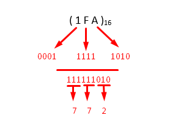

.. _s1-iict-l04:

Lecture 04
----------
Number Systems
^^^^^^^^^^^^^^
| Buckle up, this is the biggest topic for this subject.
| You might have heard of the 'base' of of a number in math. For example, 'log base 10'. What this 'base' indicates is the amount of unique symbols the system uses to represent numbers. For example, the number system we use in our day-to-day life is 'base 10', also called the decimal system (the dec- prefix means 10). This means that the decimal number system has 10 unique symbols it uses to represent all numbers, which are '0', '1', '2' and so on until '9'. After reaching the final unique symbol '9', all other numbers are represented with combinations of the first 10 unique symbols. The number '12' in base 10 can be represented as 12 :sub:`10`
| 'Base 10' isn't the only way to represent numbers, however. There are 4 number systems that we're concerned with: Binary, Decimal, Octal and Hexadecimal. Decimal is used by humans, whereas the other 3 systems are widely used by computers.
| As you might've guessed from the names, the base of the binary number system is 2 (the bi- prefix means 2), the base of the octal number system is 8, and the base of the hexadecimal number system is 16. Meaning that each of them have '2', '8' and '16' unique symbols to represent numbers, respectively.
| Let's take binary as an example, since it's what computers are built on. It only has two symbols to represent numbers, '0' and '1'. '0' in binary is also '0' in decimal, though, and '1' in binary is '1' in decimal, since they exist in both bases.
| When we start counting up, though, is when we encounter issues. '1 + 1' in decimal is '2', but '1 + 1' in binary is '10', since there's only two symbols to represent numbers. If we wanted to count numbers in binary with respect to decimal, we could instead keep counting in decimal until we encounter a combination of '0's or '1's. For example, '0' exists in both number systems and is the first value, so '0' is the same in both. Similarly, '1' exists in both, and it's the same. '2' does not exist in binary though, so to imagine that we go to the nearest combination of '1's and '0's after '1' in decimal: which is the number '10'.
| Following this, '3' in binary is just the next combination of '1's or '0's after '10', which is '11'. These numbers can be represented as 3 :sub:`10` = 11 :sub:`2`

.. figure:: images/numbersystems.png
    :scale: 80%
    :alt: a table of the 4 number systems

    Table of the 4 number systems up to 17 numbers. The only thing you need to memorize here is how binary numbers increase, and that A - F in hexadecimal represent 10-15 in decimal.

Converting Bases
^^^^^^^^^^^^^^^^
| Converting Decimal:
| This is the simplest of all conversions, just successively divide the decimal number by the base of the required number:
*     Decimal to Binary: Successively divide the decimal number by 2, and read the remainders from the bottom to the top.
.. figure:: images/decimaltobinary.png
    :scale: 90 %
            
    17 :sub:`10`  is equal to 10001 :sub:`2`

*     Decimal to Octal: Successively divide the decimal number by 8, and read the remainders from the bottom to the top.
.. figure:: images/octal.png

    148 :sub:`10` is equal to 224 :sub:`8`

*     Decimal to Hexadecimal: Successively divide the decimal number by 16, and read the remainders from the bottom to the top. If the remainder is greater than 9, give it the hexadecimal value associated with that number.
.. figure:: images/hexadecimal.png
        
    2545 :sub:`10` is equal to 9F1 :sub:`16`

| Converting Binary:
*     Binary to Decimal: Suppose that we have the digit 111 :sub:`2`. This is 7 :sub:`10` represented in binary. This binary number in decimal form will be the total sum of the numbers multiplied by 2 to the power of their position. 
.. figure:: images/binarydecimal.png
    :scale: 80 %

    111 :sub:`2` = 7 :sub:`10`

*     Binary to Octal: For any Binary value, group the binary digits into groups of 3 - and convert those 3 digits to their octal form.  
.. figure:: images/binarytooctal.png
    :scale: 80%

    110101100101 :sub:`2` = 6545 :sub:`8`

*     Binary to Hexadecimal: Similar to what we did with conversion to Octal, this time group the digits in groups of 4 - and convert *those* digits to their hexadecimal equivalent.
.. figure:: images/binarytohexadecimal.png
    :scale: 80%

    11111011101110010 :sub:`2` = 1F772 :sub:`16`

| Converting Octal:
*    Octal to Decimal: The same process for how binary numbers are converted to decimal, except the digits are multiplied by powers of 8. And remember, we start counting from the right.
.. figure:: images/octaltodecimal.png
    :scale: 80%

    37246 :sub:`8` = 16038 :sub:`10`

*    Octal to Binary: The opposite of the Binary to Octal conversion. Separate the number into single digits and convert those into their 3-digit binary.
.. figure:: images/octaltobinary.png
    :scale: 80%

    372 :sub:`8` = 11111010 :sub:`2`. We erase the left-most '0' from three's binary for brevity.

*    Octal to Hexadecimal: This one has two steps. First, convert the Octal digit to it's binary equivalent, then convert *that* binary number to hexadecimal.
.. figure:: images/octaltohex.png
    :scale: 80%

    372 :sub:`8` = FA :sub:`16`. 

| Converting Hexadecimal:
*    Hexadecimal to Decimal: Similar to the other Binary/Octal -> Decimal conversions, the digits are multiplied by powers of 16. Since we can't multiply the letters A-F by numbers, consider the numbers they represent: A represents 10, B represents 11, etc.
.. figure:: images/hextodecimal.png
    :scale: 80%

    1FA :sub:`16` = 506 :sub:`10`

*    Hexadecimal to Binary: Simply the opposite of the Binary to Hexadecimal conversion. Separate the number into single characters and convert those into their 4-digit binary.
.. figure:: images/hextobinary.png
    :scale: 80%

    1FA :sub:`16` = 11111101 :sub:`2`

*    Hexadecimal to Octal: Convert the individual Hex digits to their binary equivalent, then convert *that* binary number to it's octal equivalent.

    1FA :sub:`16` = 772 :sub:`8`

| That's it for binary representation and conversion. There is another topic, representing decimals in binary, but that's past the scope of this semester.

