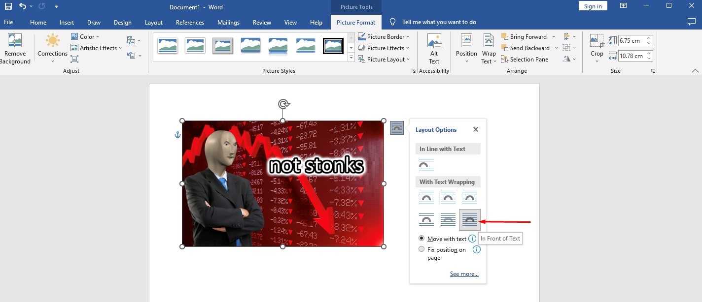

.. _s1-ict-l02:

Lecture 02
----------
Data Organization:
^^^^^^^^^^^^^^^^^^
| The important things to practice here are:
* 	 Don't keep duplicate files
* 	 Group your files in folders & sub-folders
*	 Give your files descriptive names and use underscores: "Example_file.txt"
*    Keep your desktop clean, avoid cluttering it.

Using MS Word:
^^^^^^^^^^^^^^
| The basic uses of MS Word are explored:
.. figure:: images/mswordone.png
   :scale: 50 %
   :alt: image showing ribbon and quick access toolbar

   The toolbar at the top of the window containing all the editing options you'll want like text size, color, font style, etc. is called the 'Ribbon'. The series of icons at the top left is called the 'Quick Access Toolbar', from where you can save, undo and redo your actions in the document. The tabs above the Ribbon like 'Home', 'Insert' and 'View' all have their separate ribbons, with different sets of commands for your needs.

| In this lab, we created our own newsletter. For this, we inserted images, text boxes, and columns:

.. figure:: images/mswordtwo.png
    :scale: 50 %
    :alt: figure showing how to insert images

    You can insert images by going to the 'Insert' tab and clicking on 'Insert Picture'. Images can be inserted from either your own files or from the web.

| After you've got the image you want, you can insert text under it by double-clicking where you want to start typing.

    You can change the image's Layout options as well, which allows you to move the image in between page margins and over text, allowing more freedom. This also works for Text Boxes.
 
| Text boxes can similarly be created from the 'Insert' Tab, enabling you to change the font/size/color of separate sections of text.

