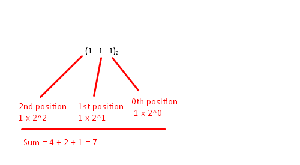

.. _s1-pf-t02:

2) Using the Binary Number System
---------------------------------

| I'll be leaving exercises at the end of every single page from now on because that's the only way to actually improve and practice. I've already made the mistake before of reading but not practising. Don't make the same mistake I did.
|
| First you need to get good at actually reading Binary numbers.
| If you know the exponents of two, this should be *very* easy for you.
| 1, 2, 4, 8, 16, 32, 64, 128, 256, 512. If you know till there then you're already capable of reading until 11 1111 1111. Which is 2\ :sup:`10` \. That's already a very large value. The more values you can understand beyond that, the more binary digits you can read.
|
| Although I explained mostly about Binary number systems on the previous page, if you understood how it works on a fundamental level then you can understand pretty much any number system on a fundamental level. Which is gonna be important for something that comes in use later called Hexadecimal, which is Base 16.

.. figure:: images/table.png
    :scale: 80%
    :alt: a table of the 4 number systems

    Table of the 4 number systems up to 17 numbers. Octal is Base 8 and Hexadecimal is Base 16. They're just there if you want to see what other Base system gets used, but right now the thing to understand most is Binary. If Octal and Hexadecimal confuse you, then just focus on Binary and Decimal instead. If Binary still confuses you, I recommend going back to ref:`s1-pf-t02` to revise it again.

Converting Bases
^^^^^^^^^^^^^^^^
| Converting from Decimal:
| Here's how you convert a Decimal (Base 10) number into a Binary number.
*     Divide the decimal number by 2, and read the remainders from the bottom to the top.
.. figure:: images/decimaltobinary.png
    :scale: 90 %
            
    17 :sub:`10`  is equal to 10001 :sub:`2`

| At some point if you do enough practice with Binary numbers then you can straight up just convert to and from it without any division at all. Again, your memory of "1,2,4,8,16,32,64,128,..." should be good. So focus on memorizing this!

| Converting from Binary: Suppose that we have the digit 111 :sub:`2`. This is 7 :sub:`10` represented in binary. This binary number in decimal form will be the total sum of the numbers multiplied by 2 to the power of their position. 

    111 :sub:`2` = 7 :sub:`10`

| That's it for binary representation and conversion. There is another topic, representing fractions in binary, but that's past the scope of this semester. 

Practice Exercises
^^^^^^^^^^^^^^^^^^

| Here's some practice exercises:
|
| 1) Convert the following from Base 10 to Base 2:
*    23
*    35
*    7
*    8
*    15
*    575
*    31
| 2) Convert the following from Base 2 to Base 10:
*    1011
*    11
*    010001
*    101010
*    0101010
*    010101
*    10101
*    11111111
*    100000000
|
| The thing you'll notice as you're going through some of them is, just like how if you add 1 to 99, if you add 1 to 1, it moves to the next position. And you'll notice more and more patterns as you go along. That's good, that means you're getting used to the system. The better you get at it, the better a programmer you'll become.
|
| Answers are on :ref:`answers`.
